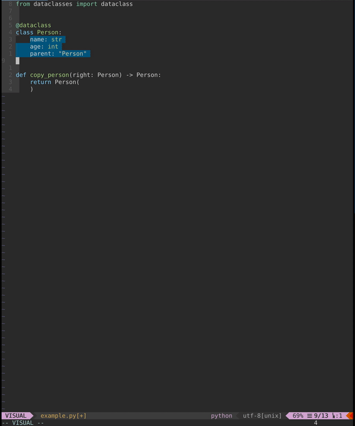

# Usage

[//]: # (start:shell`python -m mapargs.command_line --help`)
```
usage: mapargs [-h] infile

positional arguments:
  infile

optional arguments:
  -h, --help  show this help message and exit
```

[//]: # (end)

## Examples

### Python

Read input from command line:

```
mapargs -
```

[//]: # (start:shell`cat docs/python_example_infile.txt`)
```
field1: str
b: int
c: float
```

[//]: # (end)

Output:

[//]: # (start:shell`python -m mapargs.command_line docs/python_example_infile.txt`)
```
field1=source.field1,
b=source.b,
c=source.c,
```

[//]: # (end)

### Go

Read input from command line:
```
mapargs -
```
Press `<Ctrl-d>` to end input.

[//]: # (start:shell`cat docs/python_example_infile.txt`)
```
field1: str
b: int
c: float
```

[//]: # (end)
Press `<Ctrl-d>` to end input.

Output:

[//]: # (start:shell`python -m mapargs.command_line docs/go_example_infile.txt`)
```
ID: source.ID,
Field2: source.Field2,
c: source.c,
```

[//]: # (end)


# Use with vim

Put these lines in your .vimrc file.
```
nnoremap mm :call MapArgs('"')<CR>
function! MapArgs(r)
  let result = system("mapargs -", getreg(a:r, 1))
  put =result
endfunction
```

Yank(copy) the lines that only contain the fields and then press `mm` (key binding can be
changed to anything you like).



